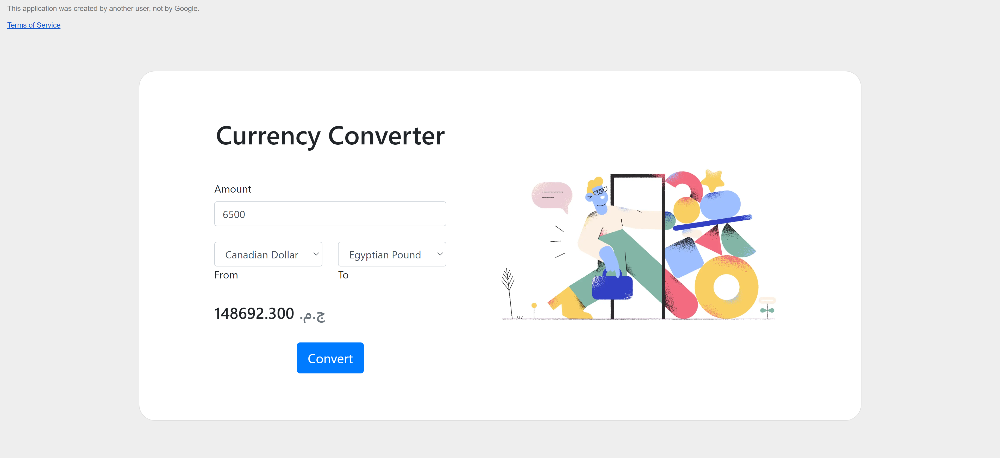

# Currency Converter

Real time currency converter with calculator feature. It's built with
google-apps-script. It offers data on exchange rates for all world currencies.
The data is fetched from a free api, and the app's homepage is built using html
& css (bootstrap) and js.

| Snapshots                                                                       |
| ------------------------------------------------------------------------------- |
| Canadian Dollar to Egyptian Pound                                               |
|  |
| Kuwaiti Dinar to Indian Rupee                                                   |
|      |
